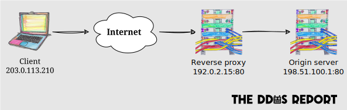

**A reverse proxy is a server that sits between an _origin server_ (aka _backend_) and its clients**,
to protect the origin server and improve performance,
amongst other reasons.
They're more commonly known as _Content Delivery Networks_ (CDNs) or _Load Balancers_ (LBs).
However,
in the context of DDoS mitigation,
we're only interested in their capacity as reverse proxies.

Reverse proxies are essential, but not sufficient, to mitigate DDoS attacks.
All server-side apps,
except for [peer-to-peer](../systems/p2p.md) ones,
can benefit from such proxies.

## Types

Reverse proxies are typically classified by the layer at which they operate,
and therefore protect.
**The higher the layer,
the more effective the proxy can be at mitigating DDoS attacks**.

### Internet layer proxy

**These proxies protect the internet layer from [volumetric attacks](../overview.md#volumetric-attacks)**
by absorbing the attack traffic.
They achieve this through the over-provisioning of bandwidth and
techniques such as [anycast IP routing](https://geekflare.com/anycast-routing-ddos-attacks/).
The malicious traffic never reaches the origin server.

Internet layer proxies are typically called _network layer proxies_,
_layer 3 proxies_ or _L3 proxies_, in reference to the OSI model.

When shopping for an internet layer proxy,
it's important to ensure that it offers unmetered inbound traffic.

These proxies are typically bundled with transport layer proxies,
rather than being offered as standalone services.

### Transport layer proxy

**These proxies protect the transport layer from [protocol attacks](../overview.md#protocol-attacks)**
by filtering traffic based on the transport layer protocol and firewall rules.
Like internet layer proxies,
they shield the origin server from the attack traffic.

Transport layer proxies are often called _layer 4 proxies_ or _L4 proxies_,
in reference to the OSI model.

These proxies typically offer the following DDoS-related features:

- **Firewall** to block traffic based on the client's IP address or other properties derived from it (e.g. its country, whether it's a known Tor node).
- **[TLS termination](https://en.wikipedia.org/wiki/TLS_termination_proxy)** to shield the origin server from slow and low attacks targeting the TLS handshake.

Self-hosted transport layer proxies,
such as [HAProxy](https://www.haproxy.org) and [IPVS](https://en.wikipedia.org/wiki/IP_Virtual_Server),
may be viable alternatives to cloud-based solutions,
but they require substantially more resources to set up and maintain.

### Application layer proxy

**These extend transport layer proxies to also protect the application layer
from [application attacks](../overview.md#application-attacks)**,
by filtering traffic based on the application layer protocol and firewall rules.

Application layer proxies are often called _layer 7 proxies_ or _L7 proxies_,
in reference to the OSI model.
[API gateways](https://www.nginx.com/resources/glossary/api-gateway/) can be considered a sophisticated form of application layer proxy.

Virtually all such proxies are HTTP proxies,
and they can offer the following DDoS-related features:

- **Web Application Firewall (WAF)** to block malicious traffic based on the content of the HTTP request (e.g. user agent), and/or transport layer information (e.g. IP address).

  WAF policies can also be based on [attack signatures](https://www.red-button.net/ddos-glossary/signatures/),
  which can come from a database of attack patterns known to the provider,
  or generated with Machine Learning (ML) based on traffic analysis for each origin server.
- **[HTTP caching](https://http.dev/caching)** to reduce the load on the origin server.
- **IP-based rate limiting** to block traffic from IP addresses that exceed a certain threshold.
- **Authentication** (e.g. JWKS verification) to block anonymous traffic.
- **Programmatic access control** to implement more sophisticated access control policies, which are typically enforced at the [edge](https://www.cloudflare.com/en-gb/learning/cdn/glossary/edge-server/).

Self-hosted application layer proxies,
such as [Nginx](https://nginx.org) and [Traefik](https://traefik.io/traefik/),
may be viable alternatives to cloud-based solutions,
but they require substantially more resources to set up and maintain.

## Cloud-based proxies

The following providers offer internet/transport and application layer proxies:

- [Akamai](https://www.akamai.com/).
- [Amazon CloudFront](https://aws.amazon.com/cloudfront/).
- [Cloudflare](https://www.cloudflare.com/).
- [Fastly](https://www.fastly.com/).
- [Google Cloud Load Balancing](https://cloud.google.com/load-balancing/).
- [Incapsula](https://www.incapsula.com/).
- [Microsoft Azure Load Balancer](https://azure.microsoft.com/solutions/load-balancing-with-azure/).
- [Netscout Arbor](https://www.netscout.com/arbor).

Vulnerable groups, such as journalists and human rights organisations,
can apply for free services from [Cloudflare](https://www.cloudflare.com/galileo/) and [Google](https://projectshield.withgoogle.com/),
for example.
