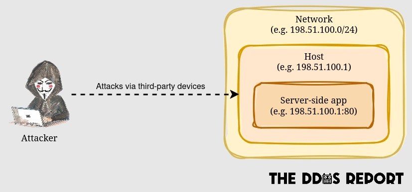
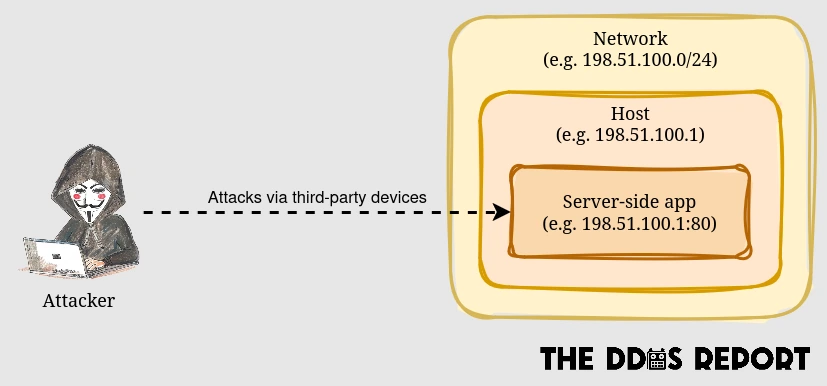
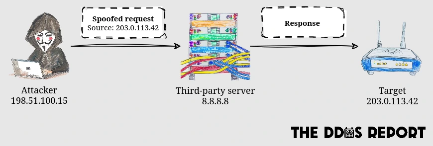
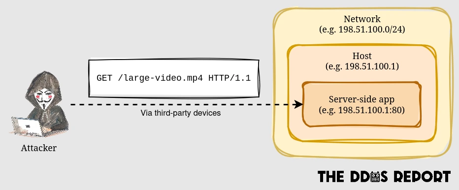
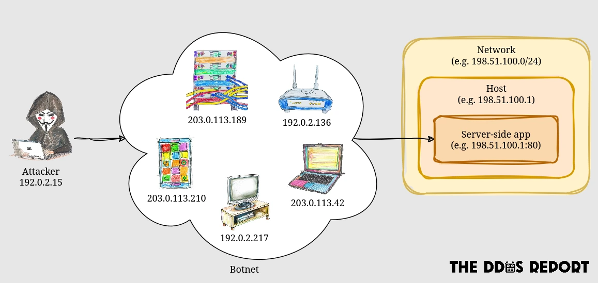

This living document provides an overview of Distributed Denial of Service (DDoS) attacks,
and is intended for developers and operators of apps connected to the Internet.

## Introduction

A DDoS attack is a type of Denial of Service (DoS) attack.
Essentially, **a DoS attack is an attempt to exhaust the resources of a system, rendering it unavailable to its intended users**.
These resources can include network bandwidth, CPU cycles, memory, disc space, file descriptors, and even the system's budget.

A regular DoS attack originates from one or a handful of IP addresses,
so it's relatively easy to mitigate once detected.
A _distributed_ DoS attack, on the other hand, can originate from thousands of IP addresses,
complicating the process of distinguishing them from legitimate traffic surges and subsequently blocking them.

The ultimate goal of a DDoS attack may not necessarily be to disrupt the target system,
but to distract the operator from a more sinister attack or to inflict distress.

In this document we refer to the implementer of a server-side app as the **app developer**,
and anyone that installs and maintains the app as the **operator**.

## Attack vectors

The literature on DDoS attacks typically categorises them by the following _vectors_:

1. **Volumetric attacks**: These involve overwhelming the bandwidth of the targeted server or network with a massive amount of traffic. Examples include [ping floods](https://www.cloudflare.com/en-gb/learning/ddos/ping-icmp-flood-ddos-attack/) and [DNS amplification attacks](https://www.cloudflare.com/en-gb/learning/ddos/dns-amplification-ddos-attack/). The intensity of these attacks is measured in bits per second (bps).
2. **Protocol attacks**: These aim to exploit a weakness in the underlying protocol (e.g. IP, TCP). Protocol attacks include [SYN floods](https://www.cloudflare.com/en-gb/learning/ddos/syn-flood-ddos-attack/), [UDP floods](https://www.cloudflare.com/en-gb/learning/ddos/udp-flood-ddos-attack/), and more. Their intensity is measured in packets per second (pps).
3. **Application attacks**: These are the most sophisticated type, targeting the server-side app itself. These attacks are executed by sending seemingly legitimate and innocuous data to the server. The intensity of application layer attacks is measured in requests per second (rps) in the case of HTTP floods.

A **multi-vector attack** combines two or more of the attacks above, either simultaneously or sequentially,
to make detection and mitigation more difficult.

## Target layers

As an app developer or operator, the attack vectors may not provide the most helpful mental model.
Instead,
it may be more helpful to think about this in terms of the [OSI model](https://en.wikipedia.org/wiki/OSI_model) layers:

### Media layers

The bottom three layers (physical, data link, network) are the media layers,
and they handle the physical transmission of data packets across the network.

Whilst all three can be attacked,
only the network (layer 3) is relevant in the context of _Distributed_ DoS attacks,
as attacking the other two layers would require physical access to the network.
Network layer protocols include the Internet Protocol (IP).

The following diagram illustrates a DDoS attack on the network layer:

**An attack on the network layer will seek to overwhelm the bandwidth of the victim's network**,
so only ISPs and hosting providers can protect this layer.
Some may offer firewalls for operators to block offending IP addresses.

### Host layers

The top four layers (transport, session, presentation, application) are the host layers,
and they focus on how applications on the host machines interact and exchange data.
The following diagram illustrates a DDoS attack on a host layer:

Two of these layers are particularly relevant:

- Application layer (layer 7):
  Most developers only implement clients and/or servers on this layer via high-level libraries that abstract away the underlying protocol (e.g. HTTP).
  **An application layer attack will seek to overwhelm the app with a high volume of messages** (e.g. requests).
- Transport layer (layer 4):
  Developers can also work on this layer by creating TCP servers and clients, for example.
  **A transport layer attack will seek to overwhelm the device hosting the app with a high volume of packets**
(or _datagrams_ in the case of UDP).
  
  According to the [Microsoft Digital Defense Report 2023](https://www.microsoft.com/en-us/security/security-insider/microsoft-digital-defense-report-2023),
  TCP was the dominant attack vector in 59% of all DDoS attacks.

App developers and operators share the responsibility of protecting the host layers,
and nearly all the [DDoS mitigations](./mitigations) are implemented at this level.

## Delivery methods

Attacks may use one or more of the methods bellow to deliver an attack:

### Reflection

In a reflection attack,
the attacker sends requests to third-party servers with the source IP address spoofed to match the victim's IP address,
causing the servers to send their responses to the victim.

These attacks typically target the network and transport layers,
but [they can also target the application layer](https://geneva.cs.umd.edu/posts/usenix21-weaponizing-censors/).

### Amplification

In an amplification attack,
the attacker sends a small amount of data,
and that causes the victim to send or receive a much larger amount of data.

These attacks typically leverage reflection.
For example, DNS amplification attacks involve sending an `ANY` query to an open DNS resolver,
which with the right domain can cause the server to send a large response to the victim.

### Botnets

A botnet is a network of devices used to carry out DDoS attacks from a broad range of IP addresses.
It usually consists of compromised IoT devices, home routers, and personal computers,
but can also involve virtual machines (VMs) from cloud providers.
Every botnet is orchestrated via a _Command and Control_ (C&C) system.

Given the time and effort it takes to build a botnet,
the attacker may use a third-party _booter_ or _stresser_ service to rent a botnet for a period of time.
Perhaps surprisingly,
a simple [DuckDuckGo](https://duckduckgo.com/?q=best+booter&kp=-2) or [Google search](https://www.google.com/search?q=best+booter) will reveal many such services,
with more available on the Dark Web.
Many accept cryptocurrency payments and won't keep any logs to protect their clients.
Some offer a free tier, or even a free trial without creating an account.

Botnets are a popular delivery method of DDoS attacks.
According to the [Nokia Threat Intelligence Report 2023](https://www.nokia.com/networks/security-portfolio/threat-intelligence-report/):

> As of 2023, about 90% of all complex, multi-vector DDoS attacks are now based on botnets.
> In addition, we are seeing between 500,000 and 1,000,000 globally distributed, remotely controlled IoT hosts or cloud server instances active on a daily basis,
> generating more than 40% of all DDoS traffic.

IoT devices have been the primary target for booters,
as manufacturers and operators tend to neglect their security.
According to the [Microsoft Digital Defense Report 2023](https://www.microsoft.com/en-us/security/security-insider/microsoft-digital-defense-report-2023):

> More than 50 percent of devices use firmware versions exposing them to more than 10 CVEs
> even though firmware significantly reducing exploitable CVEs has been available for more than 10 years.

On the other hand,
VM-based botnets have been gaining popularity in recent years,
as they offer much better connectivity than devices running on residential networks.
According to the [Cloudflare DDoS threat report for 2023 Q3](https://blog.cloudflare.com/ddos-threat-report-2023-q3):

> As we’ve seen in this campaign and previous ones,
> botnets that leverage cloud computing platforms and exploit HTTP/2 are able to generate up to **x5,000** more force per botnet node.
> This allowed them to launch hyper-volumetric DDoS attacks with a small botnet ranging 5-20 thousand nodes alone.
> To put that into perspective, in the past,
> IoT based botnets consisted of fleets of millions of nodes and barely managed to reach a few million requests per second.

## Duration

DDoS attacks can range from a few seconds to several weeks, or more.
According to the [Cloudflare DDoS threat report for 2023 Q4](https://blog.cloudflare.com/ddos-threat-report-2023-q4),
91% of attacks ended within 10 minutes,
and 2% of network-layer DDoS attacks lasted more than an hour.
The Microsoft Azure team found that [26% of attacks lasted 1–2 minutes in 2022](https://www.microsoft.com/en-us/security/blog/2023/02/21/2022-in-review-ddos-attack-trends-and-insights/).

## Emerging threats

### Expanding IoT Botnets

More compromised devices than ever

### Artificial Intelligence

- LLMs able to solve CAPTCHAS
- AI-generated strategies to bypass DDoS mitigations, roughly comparable to https://geneva.cs.umd.edu/. For example, DDoS mitigation services often employ _fingerprinting_ to identify patterns in the traffic from botnets, but AI could be used to generate traffic that doesn't follow any pattern.

### Increasing bandwidth

### Increasing device resources

CPU, memory, storage, etc.

### Increasing Internet adoption

## Conclusion

Unfortunately, there's no definitive way to _avoid_ DDoS attacks,
but there are many ways to [mitigate](mitigationsndex.md) their impact [depending on the nature of the target system](systemsndex.md).

## Further reading

- [DDoS threat report for 2023 Q4](https://blog.cloudflare.com/ddos-threat-report-2023-q4) by Cloudflare.
- [DDoS Threat Landscape Report 2023](https://www.imperva.com/resources/resource-library/reports/ddos-threat-landscape-report-2023/) by Imperva.
- [Digital Defense Report 2023](https://www.microsoft.com/en-us/security/security-insider/microsoft-digital-defense-report-2023) by Microsoft.
- [Threat Intelligence Report 2023](https://www.nokia.com/networks/security-portfolio/threat-intelligence-report/) by Nokia.
