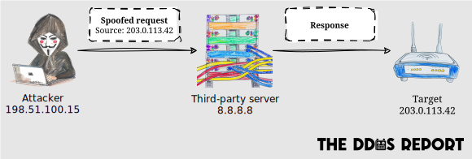

This living document provides an overview of Distributed Denial of Service (DDoS) attacks.
It is intended for developers and operators of server-side apps connected to the Internet.

## Introduction

A DDoS attack is a type of Denial of Service (DoS) attack.
Essentially, **a DoS attack is an attempt to exhaust the resources of a system,
rendering it unavailable for its intended users**.
These resources can include network bandwidth, CPU cycles, memory, disc space, file descriptors,
and even the budget allocated to the system.

A regular DoS attack originates from one or a handful of IP addresses,
so it's relatively easy to mitigate once detected.
A _distributed_ DoS attack, on the other hand, can originate from thousands of IP addresses,
complicating the process of distinguishing them from legitimate traffic surges and
subsequently blocking them.

The ultimate goal of a DDoS attack may not necessarily be to disrupt the target system,
but to extort a ransom,
cause financial harm,
inflict distress,
or create a smokescreen for a more sinister attack (e.g. data theft).

In this document we refer to the implementer of a server-side app as the **app developer**,
and anyone that installs and maintains the app as the **operator**.

## Attack vectors

The literature on DDoS attacks typically categorises them by the following _vectors_:

1. **Volumetric attacks**: These involve overwhelming the bandwidth of the targeted server or network with a massive amount of traffic. Examples include [ping floods](https://www.cloudflare.com/en-gb/learning/ddos/ping-icmp-flood-ddos-attack/) and [DNS amplification attacks](https://www.cloudflare.com/en-gb/learning/ddos/dns-amplification-ddos-attack/). The intensity of these attacks is measured in _bits per second_.
2. **Protocol attacks**: These aim to exploit a weakness in the underlying protocol (e.g. IP, TCP). Protocol attacks include [SYN floods](https://www.cloudflare.com/en-gb/learning/ddos/syn-flood-ddos-attack/), [UDP floods](https://www.cloudflare.com/en-gb/learning/ddos/udp-flood-ddos-attack/), and more. Their intensity is measured in _packets per second_.
3. **Application attacks**: These are the most sophisticated type, targeting the server-side app itself. These attacks are executed by sending seemingly legitimate and innocuous data to the server. The intensity of application layer attacks is measured in _messages per second_, or _requests per second_ in the case of HTTP floods.

A **multi-vector attack** combines two or more of the vectors above,
either simultaneously or sequentially,
to make detection and mitigation more difficult.

## Target layers

As an app developer or operator,
it may be more helpful to break down DDoS attacks by the four conceptual layers in the Internet Protocol (IP) model:

### Data link layer

The data link layer is responsible for the physical transmission of data packets across the network.
Ethernet and Wi-Fi are examples of protocols operating at this layer.

Whilst the data link layer can be attacked,
doing so would require physical access to the network,
so it's not relevant in the context of _Distributed_ DoS attacks.

### Internet layer

The internet layer is responsible for routing data packets across the network.
The Internet Protocol is the best-known protocol operating at this layer,
but others include the Internet Control Message Protocol (ICMP) and
the Internet Group Management Protocol (IGMP).

**An attack on the internet layer will seek to overwhelm the bandwidth of the victim's network**,
which can also severely impact other devices on the same network as collateral damage.

Protecting this layer primarily involves ensuring that the network has sufficient capacity to
handle the traffic,
by over-provisioning bandwidth and
using techniques such as _[anycast IP routing](https://geekflare.com/anycast-routing-ddos-attacks/)_,
which can be exceptionally complex and expensive to implement in-house.

Consequently,
the only practical way to protect this layer is for the operator to place a
[reverse proxy](./mitigations/reverse-proxies.md) between the serve-side app and the Internet.

### Transport layer

The transport layer is responsible for the delivery of data between devices.
The Transmission Control Protocol (TCP) and the User Datagram Protocol (UDP)
are the most common protocols operating at this layer.

**An attack on the transport layer will seek to overwhelm the device hosting the app
with a high volume of packets** (or _datagrams_ in the case of UDP).
According to the [Microsoft Digital Defense Report 2023](https://www.microsoft.com/en-us/security/security-insider/microsoft-digital-defense-report-2023),
TCP was the dominant attack vector in 59% of all DDoS attacks.

Reverse proxies are also the only practical way to protect this layer.

### Application layer

The application layer is responsible for the interaction between applications on the network.
The Hypertext Transfer Protocol (HTTP) and the Domain Name System (DNS)
are examples of protocols operating at this layer.
The Transport Layer Security (TLS) is a special protocol operating at this layer,
as it encapsulates other application protocols such as HTTP.

**An application layer attack will seek to overwhelm the app with a high volume of messages**
(e.g. HTTP requests).

App developers and operators share the responsibility of protecting this layer,
and nearly all the [DDoS mitigations](./mitigations) are implemented at this level.
Where it can be used,
a reverse proxy is the most effective way to protect the application layer,
especially when the application uses a protocol supported by the proxy (e.g. HTTP).

## Delivery methods

Attackers may use one or more of the methods below to deliver an attack:

### Reflection

In a reflection attack,
the attacker sends requests to third-party servers with the source IP address spoofed
to match the victim's IP address,
causing the servers to send their responses to the victim.

These attacks typically target the network and transport layers,
but [they can also target the application layer](https://geneva.cs.umd.edu/posts/usenix21-weaponizing-censors/).

### Amplification

In an amplification attack,
the attacker sends a small amount of data,
and that causes the victim to send or receive a much larger amount of data.

These attacks typically leverage [reflection](#reflection).
For example, DNS amplification attacks involve sending a query to an open DNS resolver,
which with the right domain can cause the server to send a large response to the victim.

### Botnets

A botnet is a network of devices used to carry out DDoS attacks from a broad range of IP addresses.
It usually consists of compromised IoT devices, home routers, and personal computers,
but can also involve virtual machines (VMs) from cloud providers.
They can be extremely versatile, and can attack the internet, transport and application layers.

Bootstrapping a botnet requires significant time and effort,
so attackers often rent botnets from third-party _booter_ or _stresser_ services.
Interestingly,
a quick search on [DuckDuckGo](https://duckduckgo.com/?q=best+booter&kp=-2) or [Google](https://www.google.com/search?q=best+booter) can unveil numerous such services,
with the more elusive ones available on the Dark Web.
These services typically accept cryptocurrency and maintain no logs to safeguard their customers.
Some even provide a free tier or trial, without requiring an account.

Botnets are a popular mechanism for delivering DDoS attacks.
The [Nokia Threat Intelligence Report 2023](https://www.nokia.com/networks/security-portfolio/threat-intelligence-report/) states:

> As of 2023, about 90% of all complex, multi-vector DDoS attacks are now based on botnets.
> In addition, we are seeing between 500,000 and 1,000,000 globally distributed,
> remotely controlled IoT hosts or cloud server instances active on a daily basis,
> generating more than 40% of all DDoS traffic.

Manufacturers and operators often overlook IoT device security,
making such devices prime targets for attacks.
The [Microsoft Digital Defense Report 2023](https://www.microsoft.com/en-us/security/security-insider/microsoft-digital-defense-report-2023) highlights:

> More than 50 percent of devices use firmware versions exposing them to more than 10 CVEs
> even though firmware significantly reducing exploitable CVEs has been available
> for **more than 10 years**.

Meanwhile,
VM-based botnets have gained popularity in recent years,
as they offer superior connectivity compared to devices on residential networks.
The [Cloudflare DDoS threat report for 2023 Q3](https://blog.cloudflare.com/ddos-threat-report-2023-q3) notes:

> As we’ve seen in this campaign and previous ones,
> botnets that leverage cloud computing platforms and exploit HTTP/2 are able to generate up to
> **x5,000** more force per botnet node.
> This allowed them to launch hyper-volumetric DDoS attacks with a small botnet
> ranging 5-20 thousand nodes alone.
> To put that into perspective, in the past,
> IoT based botnets consisted of fleets of millions of nodes and barely managed to reach
> a few million requests per second.

Bots are also able to change their IP address as they get blocked or throttled,
using _residential proxies_.
A [Google search](https://www.google.com/search?q=residential+ip+proxy) will reveal many of those services,
[which often acquire such IP addresses using questionable methods](https://lowendbox.com/blog/how-are-residential-ips-obtained-for-proxies-and-vpns-is-it-legal/).

## Duration

DDoS attacks can range from a few seconds to several weeks or more.
According to the [Cloudflare DDoS threat report for 2023 Q4](https://blog.cloudflare.com/ddos-threat-report-2023-q4),
91% of attacks ended within 10 minutes,
and 2% of network-layer DDoS attacks lasted more than an hour.
The Microsoft Azure team found that [26% of attacks lasted 1–2 minutes in 2022](https://www.microsoft.com/en-us/security/blog/2023/02/21/2022-in-review-ddos-attack-trends-and-insights/).

Whilst one minute may seem like a short time,
it can be enough to disrupt a service or cause financial damage,
especially if the victim relies on metered cloud resources.
For reference,
[US organisations lose an average of $6,130 per minute of downtime caused by a DDoS attack](https://www.radware.com/multi-cloud-report-2023/).

## Emerging threats

The landscape of DDoS attacks is constantly evolving.
The following are the trends that deserve special attention:

### Improving Internet infrastructure

As [more people come online](https://www.itu.int/en/ITU-D/Statistics/Pages/stat/default.aspx),
and residential and mobile networks get faster (e.g. fibre, 5G),
the potential for larger DDoS attacks increases.

### Increasing device resources

As devices, such as smartphones and laptops, get better CPUs and more storage,
they become more capable of reducing the effectiveness of certain DDoS mitigation mechanisms,
like [cryptographic challenges](./mitigations/crypto-challenges.md).

### Expanding IoT botnets

There are an estimated 15 billion IoT devices connected to the Internet in 2024,
with projections suggesting this number will double by 2030,
[according to Trending Topics](https://explodingtopics.com/blog/number-of-iot-devices).
This expansion raises significant security concerns,
considering the historically lax security of IoT devices.

However, there is cause for optimism.
Global legislative bodies have been increasingly focusing on IoT security,
enacting laws like California's SB-327 and
the UK's Product Security and Telecommunications Infrastructure (PSTI) Bill.
These laws aim to hold manufacturers accountable for device security,
including measures like prohibiting default passwords.

### Artificial Intelligence

AI deserves attention for two reasons:

- [Proprietary Large Language Models (LLMs) like GPT-4 have demonstrated the capability to solve CAPTCHAs](https://arstechnica.com/information-technology/2023/10/sob-story-about-dead-grandma-tricks-microsoft-ai-into-solving-captcha/),
  although this currently requires
  [jailbreaking](https://learnprompting.org/docs/prompt_hacking/jailbreaking).
  As open-source LLMs advance, attackers might leverage them to bypass CAPTCHAs on a large scale.
- Generative AI can produce botnet traffic devoid of identifiable patterns,
  challenging conventional mitigation techniques such as _fingerprinting_.
  This approach depends on analysing traffic to detect consistent patterns (e.g. HTTP headers, timing).

## Conclusion

DDoS attacks consistently threaten online systems, evolving with technology.
A continuous, layered defence is crucial for protecting applications and infrastructure.
Developers and operators must work together to fortify all network layers against these threats.

Whilst avoiding or stopping DDoS attacks may not be possible,
their impact can be greatly minimised.
Understanding attack vectors, delivery methods and new threats
helps in implementing preemptive [mitigation techniques](./mitigations) to reduce impact.

## Further reading

We recommend the following reports to anyone interested in learning more about DDoS attacks:

- [DDoS Threat Report for 2023 Q4](https://blog.cloudflare.com/ddos-threat-report-2023-q4) by Cloudflare.
- [DDoS Threat Landscape Report 2023](https://www.imperva.com/resources/resource-library/reports/ddos-threat-landscape-report-2023/) by Imperva.
- [DDoS Threat Intelligence Report](https://www.netscout.com/threatreport/) by NETSCOUT.
- [Digital Defense Report 2023](https://www.microsoft.com/en-us/security/security-insider/microsoft-digital-defense-report-2023) by Microsoft.
- [Threat Intelligence Report 2023](https://www.nokia.com/networks/security-portfolio/threat-intelligence-report/) by Nokia.

We also recommend the following dashboards for understanding the current state of DDoS attacks:

- [Security and Attacks](https://radar.cloudflare.com/security-and-attacks) on the Cloudflare Radar.
- [Reputation Statistics](https://www.spamhaus.org/reputation-statistics/countries/exploit/) by the Spamhaus Project.
