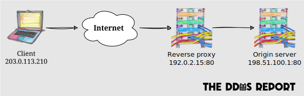

**A reverse proxy is a server that sits between an _origin server_ and its clients**,
to protect the origin server and improve performance,
amongst other reasons.
They're more commonly known as _Content Delivery Networks_ (CDNs) or _Load Balancers_ (LBs) but,
in the context of DDoS mitigation,
we're specifically interested in their capacity as reverse proxies.

Reverse proxies are essential, but not sufficient, to mitigate DDoS attacks.
All server-side apps,
except for [peer-to-peer](../mitigation.md#peer-to-peer-networks) ones,
can benefit from such proxies.

## Types

Reverse proxies are mainly classified by the highest layer that they protect.
**The more layers it covers,
the more effective the proxy can be at mitigating DDoS attacks**.

As a reminder,
the following diagram shows the different layers of the Internet Protocol (IP) model using HTTP as an example:

### Internet layer proxy

**These proxies protect the internet layer from [volumetric attacks](../overview.md#volumetric-attacks)**
by absorbing the attack traffic.
They achieve this through the over-provisioning of bandwidth and
techniques such as [anycast IP routing](https://geekflare.com/anycast-routing-ddos-attacks/).
The malicious traffic never reaches the origin server.

Internet layer proxies are typically called _network layer proxies_,
_layer 3 proxies_ or _L3 proxies_, in reference to the OSI model.

When shopping for an internet layer proxy,
it's important to ensure that it offers unmetered inbound traffic.

**We strongly recommend cloud-based internet layer proxies**,
as they're specifically designed to absorb large DDoS attacks,
unlike a comparable service from ISPs
(typically called [_clean pipe_](https://www.radware.com/security/ddos-knowledge-center/ddospedia/clean-pipe/)).
Cloud-based internet layer proxies tend to be bundled with transport layer proxies.

### Transport layer proxy

**These proxies protect the transport layer from [protocol attacks](../overview.md#protocol-attacks)**
by filtering traffic based on the transport layer protocol.
Like internet layer proxies,
they shield the origin server from the attack traffic.

Transport layer proxies are often called _layer 4 proxies_ or _L4 proxies_,
in reference to the OSI model.

These proxies can offer the following DDoS-related features:

- **Firewall** to block traffic based on the client's IP address or other properties derived from it (e.g. its country, whether it's a known Tor node).
- **[TLS termination](https://en.wikipedia.org/wiki/TLS_termination_proxy)** to shield the origin server from [exhaustion attacks](https://www.akamai.com/glossary/what-is-an-ssl-tls-exhaustion-attack), such as [D(HE)at](https://dheatattack.gitlab.io/summary/).

Self-hosted transport layer proxies,
such as [HAProxy](https://www.haproxy.org) and [IPVS](https://en.wikipedia.org/wiki/IP_Virtual_Server),
may be viable alternatives to cloud-based solutions,
but they require substantially more resources to set up and maintain.

### Application layer proxy

**These extend transport layer proxies to also protect the application layer
from [application attacks](../overview.md#application-attacks)**,
by filtering traffic based on the application layer protocol.

Application layer proxies are often called _layer 7 proxies_ or _L7 proxies_,
in reference to the OSI model.
[API gateways](https://www.nginx.com/resources/glossary/api-gateway/) can be considered a sophisticated form of application layer proxy.

Virtually all such proxies are HTTP proxies,
and they can offer the following DDoS-related features:

- **Web Application Firewall (WAF)** to block malicious traffic based on the content of the HTTP request (e.g. user agent), and/or transport layer information (e.g. IP address).
  WAF policies can also be based on [attack signatures](https://www.red-button.net/ddos-glossary/signatures/),
  which can come from a database of attack patterns known to the provider,
  or identified with Machine Learning (ML) based on traffic analysis for each origin server.
- **IP reputation** to block traffic from known bad IP addresses, or to [verify that a suspicious user is human](./humanity-verification.md). See also [client reputation scoring](./client-reputation.md).
- **IP-based rate limiting** to block traffic from IP addresses that exceed a certain threshold. See also [client-based rate limiting](./rate-limiting.md).
- **[HTTP caching](https://http.dev/caching)** to reduce the load on the origin server.
- **Authentication** to block anonymous traffic by verifying `Bearer` tokens in the `Authorization` header, for example. This feature is more commonly offered by API gateways.
- **Programmatic access control** to implement more sophisticated access control policies, which are typically enforced at the [edge](https://www.cloudflare.com/en-gb/learning/cdn/glossary/edge-server/).

Self-hosted application layer proxies,
such as [Nginx](https://nginx.org) and [Traefik](https://traefik.io/traefik/),
may be viable alternatives to cloud-based solutions,
but they require substantially more resources to set up and maintain.

## Cloud-based proxies

As mentioned above,
cloud-based proxies are the most effective at mitigating DDoS attacks.
The following are the most popular providers of internet/transport and application layer proxies:

- [Akamai](https://www.akamai.com/).
- [Amazon CloudFront](https://aws.amazon.com/cloudfront/).
- [Azure Load Balancer](https://azure.microsoft.com/solutions/load-balancing-with-azure/).
- [Cloudflare](https://www.cloudflare.com/).
- [Fastly](https://www.fastly.com/).
- [Google Cloud Load Balancing](https://cloud.google.com/load-balancing/).
- [Incapsula](https://www.incapsula.com/).
- [Netscout Arbor](https://www.netscout.com/arbor).

Vulnerable groups, such as journalists and human rights organisations,
can apply for free services from [Cloudflare](https://www.cloudflare.com/galileo/) and [Google](https://projectshield.withgoogle.com/),
for example.
